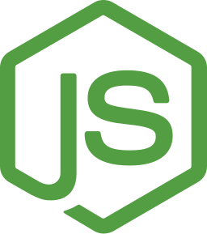
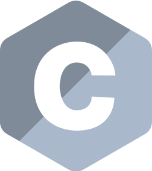
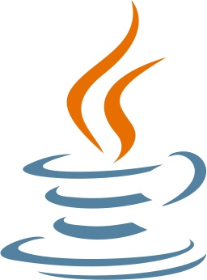
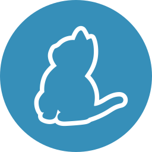

<h1 align="center">Kaushal - <a href="https://kaush.me">@k4u5h4L</a></h1>

  
    
  

     Hey there 👋, I'm Kaushal, a software engineer at Barclays, Glasgow, and a Computer Science MSc graduate from the University of Warwick in England. I'm a full stack developer, a cyber security enthusiast and an open source lover. I occasionally mess around with ML and AI with Python.
  

   

  <!-- 

    
  
 -->

<!-- 
 Got something in mind? Hit me up!

- LinkedIn : [linkedin.com/in/kaushal-bhat-8374451a2](https://www.linkedin.com/in/kaushal-bhat-8374451a2/)

- Mail : [kaushal@kaush.me](mailto:kaushal@kaush.me)

- Portfolio : [kaush.me](https://kaush.me/)

- dev-to : [dev.to/k4u5h4l](https://dev.to/k4u5h4l)

 -->

<h3 align="center">Languages and tools (my tech stack keeps shifting, so this list is really old 😉 )</h3>

&nbsp;
<!-- <code></code> -->

&nbsp;

&nbsp;

&nbsp;

&nbsp;

&nbsp;

&nbsp;

&nbsp;

&nbsp;

&nbsp;
<!-- 
&nbsp;

&nbsp;

&nbsp; -->

&nbsp;

&nbsp;

&nbsp;

&nbsp;

&nbsp;

&nbsp;

&nbsp;

&nbsp;

&nbsp;

&nbsp;

&nbsp;

&nbsp;

&nbsp;

&nbsp;

&nbsp;

&nbsp;

&nbsp;

&nbsp;

&nbsp;

&nbsp;
<!-- 
&nbsp; -->

  

<h2 align="center">Get in touch </h2>

  <i>Got something in mind? Hit me up!</i>

  

    &nbsp;
    
    
  

  

<!--

  
-->

<!--
**k4u5h4L/k4u5h4L** is a ✨ _special_ ✨ repository because its `README.md` (this file) appears on your GitHub profile.

Here are some ideas to get you started:

- 🔭 I’m currently working on ...
- 🌱 I’m currently learning ...
- 👯 I’m looking to collaborate on ...
- 🤔 I’m looking for help with ...
- 💬 Ask me about ...
- 📫 How to reach me: ...
- 😄 Pronouns: ...
- ⚡ Fun fact: ...
-->
